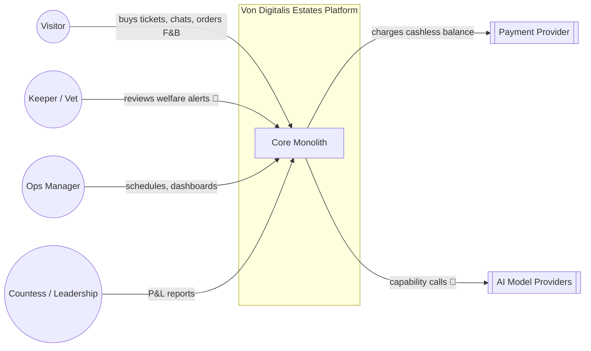
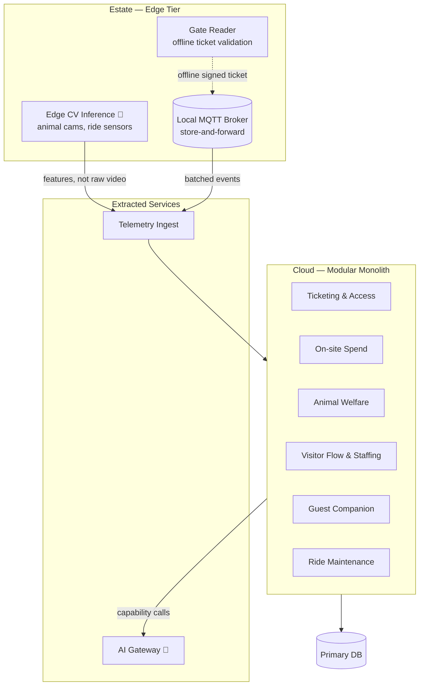

# Architecture

## Style: modular monolith with selective extraction

A single deployable core, organized into modules along the same seams a microservices
decomposition would use (Ticketing & Access, On-site Spend, Animal Welfare, Visitor Flow, Guest
Companion, Ride Maintenance) — but shipped, deployed, and operated as one unit, with one
database, one deployment pipeline, one on-call rotation.

We extract a component out of the monolith only when it has a genuinely different
non-functional profile that the monolith can't satisfy — not by default, not because "AI
services should be microservices." See [ADR-001](adrs/ADR-001-modular-monolith.md) for the full
trade-off. Two things are extracted at launch:

- **AI Gateway** — different deployment cadence (model/prompt changes ship independently of
  business logic), different scaling profile (bursty, provider-latency-bound), and it's the
  single place cost and provider risk get managed ([05-ai-platform.md](05-ai-platform.md)).
- **Telemetry Ingest** — runs at the edge/cloud boundary, needs to survive connectivity outages
  independently of whether the core application is even up ([03-edge-and-connectivity.md](03-edge-and-connectivity.md)).

Everything else stays in the monolith. Modules talk to each other in-process by default;
cross-module calls that need to survive a module being temporarily degraded go through an
internal event log (outbox pattern), not a message broker — we don't need broker operational
overhead for cross-module calls inside one deployable.

## Driving characteristics

1. **Connectivity resilience** — the estate's Wi-Fi is patchy by brief; nothing safety- or
   revenue-critical (gate entry, cashless spend, local welfare alerts) may depend on the cloud
   being reachable at that instant.
2. **Operability by a small team** — the estate does not have a platform engineering
   organization. Every architectural choice is filtered through "can 3-5 people run this on-call
   without burning out" (see [07-operations.md](07-operations.md)).
3. **Evolvability of the AI layer specifically** — models and providers will change faster than
   the rest of the system; the AI Gateway exists to contain that churn so it doesn't leak into
   every module ([ADR-004](adrs/ADR-004-ai-gateway-provider-indirection.md)).
4. **Cost accountability** — every AI capability is funded against a lever, not against
   enthusiasm ([ADR-005](adrs/ADR-005-ai-funding-gate.md)).

Deliberately **not** driving characteristics: independent team scalability (one team owns the
whole monolith), polyglot flexibility (one stack, chosen for team familiarity), infinite
horizontal scale (15,000 visitors/day is a real number, not a hyperscale problem).

## Architecture style — ATAM-style worksheet

We scored five candidate styles against the four driving characteristics above, plus two
general quality attributes every candidate has to clear regardless of theme. Scale: ✅ strong fit
· 🟡 partial / achievable with extra work · ❌ poor fit, fights the characteristic.

| Style | Connectivity resilience | Small-team operability | AI-layer evolvability | Cost accountability | Time-to-first-capability | Testability |
|---|---|---|---|---|---|---|
| **Modular monolith + selective extraction** (chosen) | ✅ edge tier is independent of this choice either way; in-process core has no partial-failure mode of its own | ✅ one deploy, one on-call, one schema — see [ADR-001](adrs/ADR-001-modular-monolith.md) | ✅ AI Gateway extracted specifically to isolate this churn ([ADR-004](adrs/ADR-004-ai-gateway-provider-indirection.md)) | ✅ one place to see total spend once AI Gateway is extracted | ✅ no cross-service scaffolding before feature work starts | ✅ in-process calls, ordinary integration tests |
| Microservices / architectural quanta per business domain | 🟡 resilience becomes 11-13 separate concerns instead of one edge-tier concern | ❌ 11-13 deploy pipelines and on-call surfaces for a 3-5 person team | 🟡 AI churn is isolated by default, but so is every other kind of churn — no differentiated benefit for AI specifically | 🟡 spend visibility requires cross-service cost aggregation tooling that doesn't exist yet | ❌ service scaffolding, contracts, and CI per quantum before feature work | 🟡 requires contract/integration test infrastructure across service boundaries |
| Event-driven microservices with CQRS/ES throughout | 🟡 same 11-13-surface cost as above, plus eventual-consistency reasoning on every read | ❌ adds event-sourcing operational literacy on top of the microservices cost above | ✅ AI capabilities read from projections cleanly | ❌ hardest of the five to attribute AI cost per capability without dedicated tooling | ❌ highest of the five — projections, replay tooling, schema evolution before first feature | 🟡 event-sourced testing is powerful but has real ramp-up cost |
| Serverless / FaaS per AI capability | ✅ naturally degrades per-function | 🟡 no servers to patch, but five separate deployment/observability configs to maintain | ✅ each capability's runtime is trivially swappable | 🟡 pay-per-invocation is legible, but cold-start cost is a new variable to budget for | 🟡 fast to first function, slower once five need to share the domain data model coherently | 🟡 good unit-level testability, weaker for cross-capability integration |
| Single undifferentiated monolith, no internal module boundaries | ✅ same edge-tier independence as our choice | 🟡 cheapest to start, but ownership blurs as the team and codebase grow | ❌ AI churn has no seam to contain it — a provider change risks touching unrelated code paths | ❌ no natural boundary to attribute AI spend against | ✅ fastest of all five to a first feature | 🟡 fine early, degrades as the codebase grows without seams |

**Reading the worksheet:** the modular monolith doesn't win every cell — event-driven CQRS/ES
scores as well or better on pure AI-layer evolvability, and serverless matches it on connectivity
resilience. It wins on the two characteristics we actually weighted highest for *this* team at
*this* scale — small-team operability and cost accountability — while staying acceptable
everywhere else. That is the ATAM point: the "best" style is the one that wins the
characteristics you prioritized, not the one that wins the most cells.

## Diagram — System context

## Diagram — Container view

## Why not microservices / architectural quanta

Both competing submissions in this kata chose 11-13 independently deployed services/quanta with
per-service databases. That buys independent scalability and team autonomy — neither of which
this estate needs at 15,000 visitors/day with a team of 3-5 engineers. What it costs: 11-13
deployment pipelines, 11-13 places a cross-service saga can partially fail, and an operational
surface area that assumes a platform team which doesn't exist here.

| | Modular monolith (ours) | Quanta / microservices (both competitors) |
|---|---|---|
| Independent scaling per domain | No — acceptable, no domain here needs it independently | Yes |
| Cross-domain transaction complexity | Low (in-process, one DB) | High (sagas, eventual consistency everywhere) |
| Operational surface for a 3-5 person team | One deploy, one on-call | 11-13 deploys, 11-13 failure surfaces |
| Cost of getting it wrong | Refactor a module boundary | Undo a network boundary — much harder |

We extract only where the trade-off is clearly worth it (AI Gateway, Telemetry Ingest — see
above). Full reasoning and alternatives table in [ADR-001](adrs/ADR-001-modular-monolith.md).
