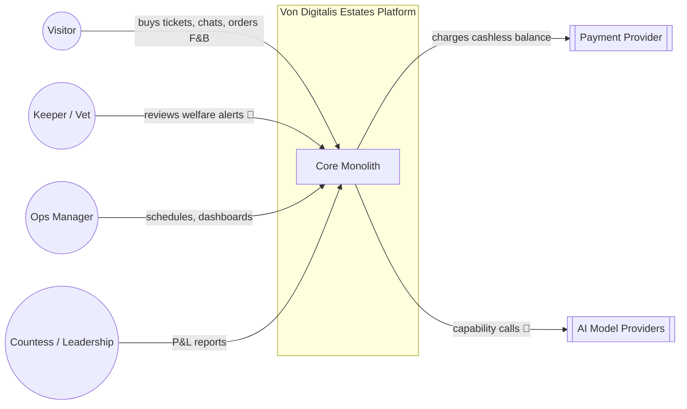
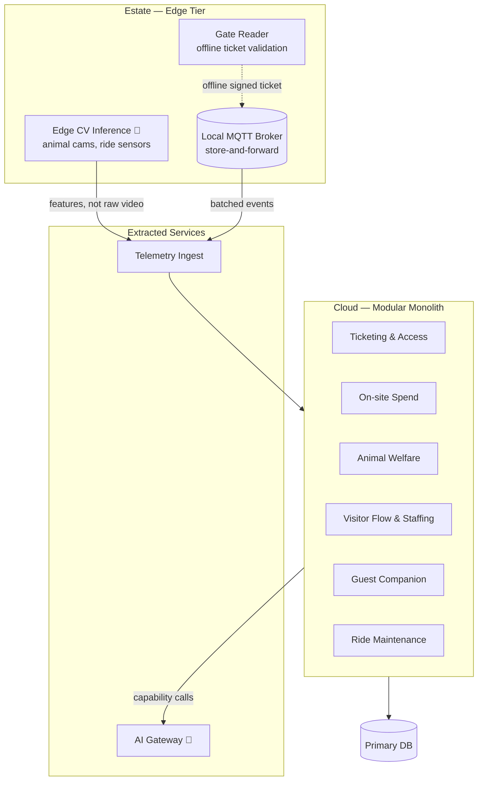

# Architecture

## Style: modular monolith with selective extraction

A single deployable core, organized into modules along the same seams a microservices
decomposition would use (Ticketing & Access, On-site Spend, Animal Welfare, Visitor Flow, Guest
Companion, Ride Maintenance) — but shipped, deployed, and operated as one unit, with one
database, one deployment pipeline, one on-call rotation.

We extract a component out of the monolith only when it has a genuinely different
non-functional profile that the monolith can't satisfy — not by default, not because "AI
services should be microservices." See [ADR-001](adrs/ADR-001-modular-monolith.md) for the full
trade-off. Two things are extracted at launch:

- **AI Gateway** — different deployment cadence (model/prompt changes ship independently of
  business logic), different scaling profile (bursty, provider-latency-bound), and it's the
  single place cost and provider risk get managed ([05-ai-platform.md](05-ai-platform.md)).
- **Telemetry Ingest** — runs at the edge/cloud boundary, needs to survive connectivity outages
  independently of whether the core application is even up ([03-edge-and-connectivity.md](03-edge-and-connectivity.md)).

Everything else stays in the monolith. Modules talk to each other in-process by default;
cross-module calls that need to survive a module being temporarily degraded go through an
internal event log (outbox pattern), not a message broker — we don't need broker operational
overhead for cross-module calls inside one deployable.

## Driving characteristics

1. **Connectivity resilience** — the estate's Wi-Fi is patchy by brief; nothing safety- or
   revenue-critical (gate entry, cashless spend, local welfare alerts) may depend on the cloud
   being reachable at that instant.
2. **Operability by a small team** — the estate does not have a platform engineering
   organization. Every architectural choice is filtered through "can 3-5 people run this on-call
   without burning out" (see [07-operations.md](07-operations.md)).
3. **Evolvability of the AI layer specifically** — models and providers will change faster than
   the rest of the system; the AI Gateway exists to contain that churn so it doesn't leak into
   every module ([ADR-004](adrs/ADR-004-ai-gateway-provider-indirection.md)).
4. **Cost accountability** — every AI capability is funded against a lever, not against
   enthusiasm ([ADR-005](adrs/ADR-005-ai-funding-gate.md)).

Deliberately **not** driving characteristics: independent team scalability (one team owns the
whole monolith), polyglot flexibility (one stack, chosen for team familiarity), infinite
horizontal scale (15,000 visitors/day is a real number, not a hyperscale problem).

## Diagram — System context

## Diagram — Container view

## Why not microservices / architectural quanta

Both competing submissions in this kata chose 11-13 independently deployed services/quanta with
per-service databases. That buys independent scalability and team autonomy — neither of which
this estate needs at 15,000 visitors/day with a team of 3-5 engineers. What it costs: 11-13
deployment pipelines, 11-13 places a cross-service saga can partially fail, and an operational
surface area that assumes a platform team which doesn't exist here.

| | Modular monolith (ours) | Quanta / microservices (both competitors) |
|---|---|---|
| Independent scaling per domain | No — acceptable, no domain here needs it independently | Yes |
| Cross-domain transaction complexity | Low (in-process, one DB) | High (sagas, eventual consistency everywhere) |
| Operational surface for a 3-5 person team | One deploy, one on-call | 11-13 deploys, 11-13 failure surfaces |
| Cost of getting it wrong | Refactor a module boundary | Undo a network boundary — much harder |

We extract only where the trade-off is clearly worth it (AI Gateway, Telemetry Ingest — see
above). Full reasoning and alternatives table in [ADR-001](adrs/ADR-001-modular-monolith.md).
