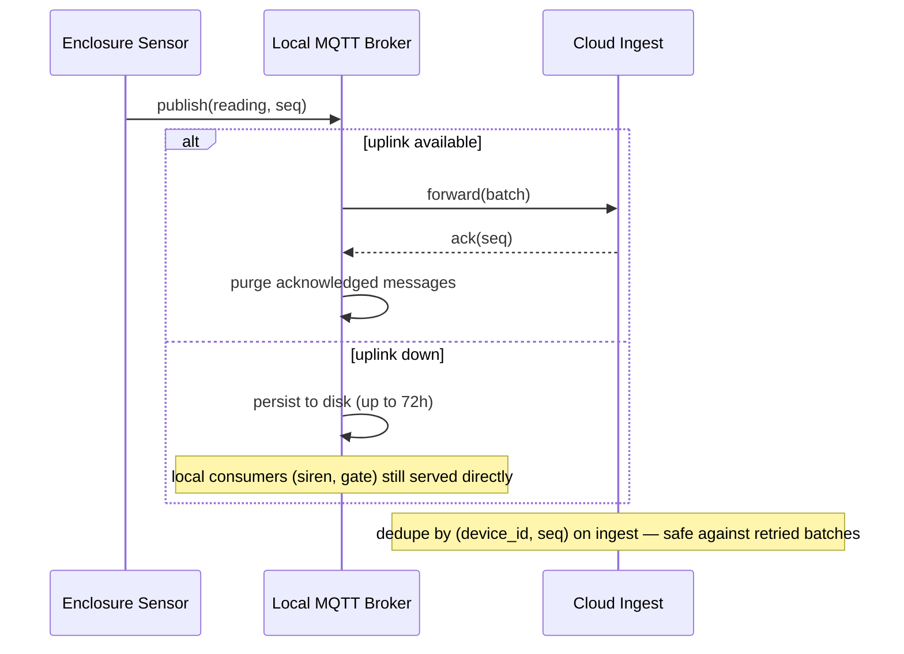

# Edge & Connectivity

Patchy Wi-Fi is the one technical constraint the brief states outright, so it gets treated as a
first-class driving characteristic, not an edge case to patch over later.

## What must work with zero connectivity

- **Gate entry** — tickets are signed credentials, verified against a public key stored on the
  gate device. No network call required to admit a valid ticket.
- **Cashless spend at point of sale** — balance and last-known-good fraud rules are cached on
  the terminal; transactions queue for reconciliation.
- **Local welfare alerts** — if an enclosure sensor trips a rule-based threshold (not a model),
  the alert fires on a local siren/pager immediately. It does not wait for a cloud round-trip.
- **Ride safety interlocks** — entirely local, entirely deterministic, never touch the network
  or a model (see [ADR-003](adrs/ADR-003-deterministic-core.md)).

## MQTT store-and-forward

Every estate device (enclosure sensors, ride telemetry, edge CV nodes, gate readers) publishes
to a local MQTT broker running on-site, not directly to the cloud. The broker:

- persists messages to disk (QoS 1), sized for **72 hours of buffer** — enough to survive a
  multi-day connectivity incident without data loss;
- forwards to Telemetry Ingest in the cloud opportunistically, in batches, whenever uplink is
  available;
- lets local consumers (the safety-alert siren, the gate device) read straight off the broker
  without waiting on the cloud round-trip at all.

Cloud ingest deduplicates by `(device_id, seq)` so a retried batch after a flaky reconnect never
double-counts a reading. Ordering is only guaranteed per-device, which is all any consumer here
actually needs (nobody needs global ordering across two different enclosures' sensors).

## Degraded ladder

| Level | Cloud reachable? | AI reachable? | What still works |
|---|---|---|---|
| Full | Yes | Yes | Everything, including AI Gateway calls (concierge, forecasts, welfare anomaly scoring) |
| Cloud, no AI | Yes | No (provider outage/budget cut) | Ticketing, cashless spend, dashboards — all fall back to their deterministic paths; AI capabilities show cached/last-known results with a visible staleness flag |
| Estate-only | No | No | Gate entry, cashless spend (queued), local safety alerts, ride interlocks. Telemetry buffers locally for up to 72h |

Every AI capability in [04-ai-capabilities/](04-ai-capabilities/README.md) has a stated
deterministic fallback for exactly this reason — see each capability's "Approach" section.

## Diagram — Edge sequence (store-and-forward)

