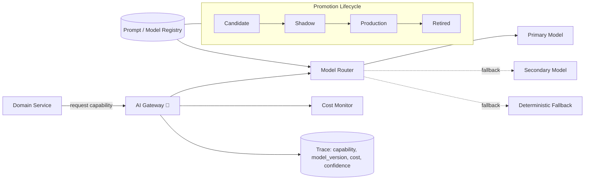

# AI Platform

The AI Gateway is the one place every AI capability's provider risk, cost, and evaluation
lifecycle gets managed — extracted from the monolith specifically because it needs to evolve
faster than the rest of the system ([ADR-004](adrs/ADR-004-ai-gateway-provider-indirection.md)).

## Capability contract

Domain services never call a model or a provider directly. They request a **capability** (e.g.
`welfare-anomaly-score`, `concierge-answer`, `spend-offer-rank`) and the gateway resolves that to
a versioned bundle of `{model, prompt/config, eval suite}`. Swapping a provider or a model
version means publishing a new bundle version that passes the capability's eval suite — it never
means touching the calling code. This is also where the language parameter for C4 lives: `{
capability: concierge-answer, language: de }` resolves to a bundle validated for German, not just
whatever the English eval suite happened to pass.

## Provider indirection & budgets

- **Per-capability budget** with cost telemetry; alerts at 70%/90% of budget, automatic downgrade
  to a cheaper tier at 100% rather than a silent cost overrun.
- **Tiered routing**: cheap/fast model as default, escalate to a stronger model only when the
  cheap tier's own confidence signal is low.
- **Named secondary provider** for every capability, shadow-tested periodically so "switch
  providers" is a config change validated ahead of time, not a scramble during an outage.
- **Deterministic fallback always exists** below the model tier — every capability in
  [04-ai-capabilities/](04-ai-capabilities/README.md) states what it does with zero AI available.

This directly answers "what happens if the best model today isn't the best tomorrow" and "what
happens if our provider shuts down or changes prices": neither event touches calling code, both
are config/registry changes gated by the same eval suite every other model change goes through.

## Promotion lifecycle, spelled out

The `Candidate → Shadow → Production → Retired` stages in the diagram below aren't just names:

- **Candidate**: passes the offline eval suite ([06-verification.md](06-verification.md)) and
  the calibration check — not scored against live traffic yet.
- **Shadow**: scores against live production traffic for a minimum of **3 days or 1,000 scored
  inferences, whichever is longer**, without its output ever reaching a visitor, keeper, or
  inspector. A Shadow bundle that would have breached its fitness threshold on real traffic never
  reaches Production.
- **Production**: live, monitored per [06-verification.md](06-verification.md)'s drift and
  fitness gates.
- **Retired**: kept, not deleted, for the rollback target every automatic rollback in
  [06-verification.md](06-verification.md) reverts *to* — a bundle is only purged after its
  successor has spent one full season in Production without a rollback event.

Every bundle carries a **model card**: capability, base model/version, eval-suite results at
promotion time, stated known limitations (e.g. C1's RGB behavior-scoring bundle: "not validated
for low-light nocturnal enclosures — flagged out-of-range rather than silently scored outside its
validated illumination band"), and the specific Retired bundle it would roll back to. This is
what a capability owner reads before approving a promotion — not the raw eval numbers alone.

## Diagram — AI capability pipeline

