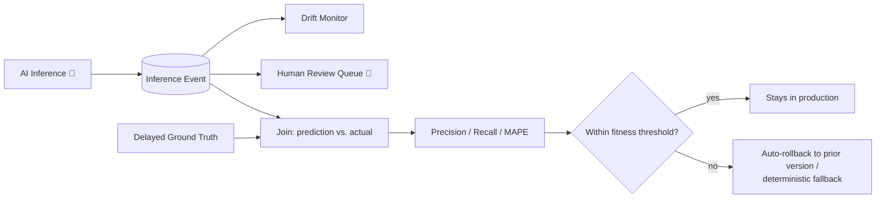

# Verification

This is the direct answer to judging criterion 6 — how we know an AI-driven capability is
actually working, and how we'd know if it started misbehaving in production.

## Fitness functions / eval gates

Every capability has numeric, not vague, thresholds, checked in CI before a new model/prompt
bundle is promoted, and re-checked continuously in production:

| Capability | Metric | Threshold | Action on breach |
|---|---|---|---|
| C1 Welfare | Recall on held-out welfare incidents | ≥ 0.90 | Block promotion; keep prior bundle |
| C1 Piranha count | Estimate vs. monthly manual audit | within stated CI 90% of the time | Widen reported CI; flag for camera recalibration |
| C1 Welfare | Weekly false-negative audit (live production sample, not held-out) | consistent with held-out recall (≤10% false-negative) | Recalibrate confidence-band thresholds ([ADR-006](adrs/ADR-006-confidence-bands-cost-of-error.md)) — this is R4's mitigation made measurable, not a rollback trigger by itself |
| C1 Individual attribution | % of feed/health events attributed to a single tagged individual (vs. ambiguous/enclosure-level fallback) in shared enclosures | ≥ 0.95 | Fall back to enclosure-level aggregate reporting for that enclosure; flag for re-tagging or sensor check (this is R5's mitigation made measurable) |
| C2 Forecast | MAPE vs. naive baseline | must beat naive baseline | Revert to naive baseline (see [04-ai-capabilities/README.md](04-ai-capabilities/README.md)) |
| C2 Pricing guidance | Realized revenue, corridor-auto-applied adjustments vs. static pricing (rolling month) | must not underperform static pricing | Disable auto-apply; require sign-off on every adjustment until root-caused |
| C2 Pricing guidance | Corridor-bound violations (adjustment outside Countess-set min/max/max-Δ) | 0 — this is a hard invariant, not a probabilistic threshold | Any violation is a bug, not a model-quality issue: page immediately, freeze auto-apply |
| C3 Offers | Pre-order conversion vs. queue-based baseline | must beat baseline within one season | Disable contextual offers, keep static menu |
| C4 Companion | Groundedness (claims cite a source) | ≥ 0.95 | Guardrail blocks ungrounded response, logs as KB gap |
| C4 Companion | Safety-relevant refusal rate | 100% (this is a gate, not an optimizable metric) | Any miss triggers an immediate rollback, no exceptions |
| C4 Companion | Adversarial/prompt-injection red-team pass (curated corpus, refreshed quarterly with newly published injection techniques) | 0 successful extractions or manipulated offers | Block promotion until patched; corpus refresh itself is tracked so "100% on a stale corpus" can't quietly pass as safe |
| C4 Companion PWA | WCAG 2.2 AA violations (axe-core scan, CI) | 0 critical/serious | Block release — accessibility is a functional regression, not a follow-up ticket ([ADR-012](adrs/ADR-012-multilingual-accessible-companion.md)) |
| C4 Companion PWA | Cached itinerary/map load success, tested on a representative low-end device under a simulated patchy-Wi-Fi profile (throttled + intermittent packet loss), CI | ≥ 0.99 successful load from local cache within 3s | Block release — offline itinerary access is a stated requirement ([03-edge-and-connectivity.md](03-edge-and-connectivity.md)), not best-effort |
| C5 Maintenance | Precision on flagged-ride inspections | ≥ 0.60 | Revert to fixed inspection schedule (inspector alert fatigue outweighs the benefit below this) |

## Confidence calibration

Every threshold above that reads a `confidence` value — tiered-routing escalation
([ADR-004](adrs/ADR-004-ai-gateway-provider-indirection.md)), cost-of-error bands
([ADR-006](adrs/ADR-006-confidence-bands-cost-of-error.md)), corridor-bound pricing auto-apply —
is only as honest as that number itself. A raw model confidence score is a ranking signal by
default, not a calibrated probability; treating 0.9 as "90% likely to be right" without checking
is the same unexamined-threshold mistake [ADR-006](adrs/ADR-006-confidence-bands-cost-of-error.md)
already argues against for cost(FP)/cost(FN), one level further down the stack.

Every bundle is checked for calibration on its held-out set **before** promotion, not just for
accuracy/recall: **Brier score ≤ 0.15**, and a reliability diagram reviewed for systematic
over/under-confidence in any band. A bundle that clears its accuracy fitness function but fails
calibration is not promoted as-is — it's recalibrated first (temperature scaling or isotonic
regression on the held-out set). Until a capability has passed this check at least once, its
confidence score is treated as ordinal (for ranking/routing) only, never as a probability fed
into a cost-of-error calculation.

## Edge model lifecycle & IoT verification

Everything above describes cloud-side verification. Edge inference (C1 welfare cameras, C5 ride
sensors) gets the same rigor via [ADR-016](adrs/ADR-016-edge-model-lifecycle-and-sensor-calibration.md) —
edge bundles are versioned and eval-gated the same way cloud bundles are, physical sensors have a
calibration schedule instead of only reactive cross-confirmation, and the golden-set methodology
behind every "≥0.90 recall" claim above is specified there rather than left implicit.

## Latency budget for visitor-facing AI

Neither competing submission budgets latency for the part of the system a visitor actually
experiences interactively — ticketing and analytics get a p95 target, the concierge chat doesn't.
We give it one, broken down by hop so it's actually actionable:

| Hop | Budget | Notes |
|---|---|---|
| Retrieval (KB + live data lookups) | 400ms | Cached where possible (queue times, ride status) |
| Model inference | 900ms | Tiered routing — cheap model first |
| Guardrail / groundedness check | 300ms | Runs in parallel with rendering the partial response where possible |
| Render / round-trip | 200ms | |
| **Total target (p95)** | **≤ 1.8s** | Anything slower gets a "thinking..." indicator, not a silent hang |

## Production monitoring & rollback

Every inference is an event ([ADR-010](adrs/ADR-010-every-inference-is-an-event.md)) carrying
`capability`, `model_version`, `cost`, and `confidence`. Delayed ground truth (a vet's actual
diagnosis, an inspector's actual finding, an actual visitor headcount) is joined against past
predictions on a rolling basis to compute real-world precision/recall, not just offline eval
numbers. A drift signal or a fitness-function breach triggers automatic rollback to the last
known-good bundle version — no manual intervention required to stop a misbehaving model, only to
diagnose it afterward.

Drift is measured as **Population Stability Index (PSI)** between each capability's training/eval
feature distribution and its live input distribution — the reference distribution is the static
snapshot attached to the promoted bundle at training time, not a live query against a shared
feature store ([ADR-017](adrs/ADR-017-no-lakehouse-feature-store-at-launch.md) specifies why
there isn't one); PSI > 0.2 on any tracked feature raises a
drift alert and forces a shadow re-evaluation of the currently-promoted bundle before its next
scheduled promotion cycle, rather than waiting for a fitness-gate breach to notice after the
fact. This is also what the **Shadow** stage in the promotion lifecycle
([05-ai-platform.md](05-ai-platform.md)) is for on the way *in*: every new bundle scores against
live traffic without acting on it for a burn-in period before Production promotion, so a bundle
that would have failed the fitness gate never reaches a real visitor, keeper, or inspector in the
first place.

## Diagram — Verification loop

