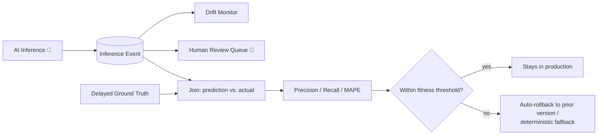

# Verification

This is the direct answer to judging criterion 6 — how we know an AI-driven capability is
actually working, and how we'd know if it started misbehaving in production.

## Fitness functions / eval gates

Every capability has numeric, not vague, thresholds, checked in CI before a new model/prompt
bundle is promoted, and re-checked continuously in production:

| Capability | Metric | Threshold | Action on breach |
|---|---|---|---|
| C1 Welfare | Recall on held-out welfare incidents | ≥ 0.90 | Block promotion; keep prior bundle |
| C1 Piranha count | Estimate vs. monthly manual audit | within stated CI 90% of the time | Widen reported CI; flag for camera recalibration |
| C2 Forecast | MAPE vs. naive baseline | must beat naive baseline | Revert to naive baseline (see [04-ai-capabilities/README.md](04-ai-capabilities/README.md)) |
| C3 Offers | Pre-order conversion vs. queue-based baseline | must beat baseline within one season | Disable contextual offers, keep static menu |
| C4 Companion | Groundedness (claims cite a source) | ≥ 0.95 | Guardrail blocks ungrounded response, logs as KB gap |
| C4 Companion | Safety-relevant refusal rate | 100% (this is a gate, not an optimizable metric) | Any miss triggers an immediate rollback, no exceptions |
| C5 Maintenance | Precision on flagged-ride inspections | ≥ 0.60 | Revert to fixed inspection schedule (inspector alert fatigue outweighs the benefit below this) |

## Latency budget for visitor-facing AI

Neither competing submission budgets latency for the part of the system a visitor actually
experiences interactively — ticketing and analytics get a p95 target, the concierge chat doesn't.
We give it one, broken down by hop so it's actually actionable:

| Hop | Budget | Notes |
|---|---|---|
| Retrieval (KB + live data lookups) | 400ms | Cached where possible (queue times, ride status) |
| Model inference | 900ms | Tiered routing — cheap model first |
| Guardrail / groundedness check | 300ms | Runs in parallel with rendering the partial response where possible |
| Render / round-trip | 200ms | |
| **Total target (p95)** | **≤ 1.8s** | Anything slower gets a "thinking..." indicator, not a silent hang |

## Production monitoring & rollback

Every inference is an event ([ADR-010](adrs/ADR-010-every-inference-is-an-event.md)) carrying
`capability`, `model_version`, `cost`, and `confidence`. Delayed ground truth (a vet's actual
diagnosis, an inspector's actual finding, an actual visitor headcount) is joined against past
predictions on a rolling basis to compute real-world precision/recall, not just offline eval
numbers. A drift signal or a fitness-function breach triggers automatic rollback to the last
known-good bundle version — no manual intervention required to stop a misbehaving model, only to
diagnose it afterward.

## Diagram — Verification loop

