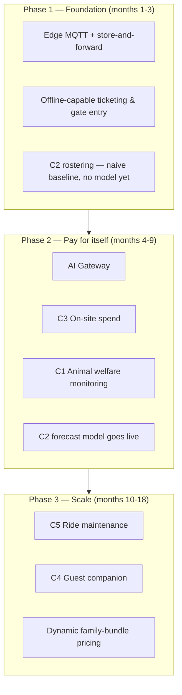

# Roadmap

Three phases, and each phase is funded by the payback the previous one already demonstrated —
not everything launching at once on a single leap of faith.

## Phase 1 — Foundation (months 1-3)

Nothing here is AI. This has to exist before any AI capability has data or infrastructure to sit
on: edge MQTT store-and-forward, offline-capable ticketing and gate entry, and C2's rostering
running on the naive baseline (no forecast model yet — there isn't enough footfall history to
train one). This phase de-risks the connectivity story, which is the precondition for
everything else.

## Phase 2 — Pay for itself (months 4-9)

The three capabilities with the clearest, fastest payback in
[08-cost-and-payback.md](08-cost-and-payback.md) ship here: **C3 on-site spend** (fastest,
least AI-dependent), **C1 animal welfare monitoring**, and the **AI Gateway** itself (needed by
both, and by C2's forecast model once enough Phase 1 footfall data exists to train it). C2's
forecast model goes live at the end of this phase.

## Phase 3 — Scale (months 10-18)

**C5 ride maintenance** and **C4 guest companion** ship once Phase 2's revenue and cost
improvements have funded them — C4 specifically, because it's the capability with the least
certain payback (see [08-cost-and-payback.md](08-cost-and-payback.md)), it's the one we're least
willing to fund speculatively. Dynamic family-bundle pricing (an extension of C2) also ships
here, once a full season of forecast-accuracy data exists to trust it with pricing decisions.

## Diagram — Deployment & phasing

