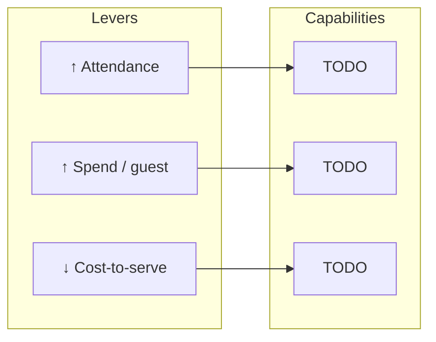

<!-- TODO(johny): team name -->
# Von Digitalis Estates — [team name]

<!--
TODO(johny): narrative, 2-4 paragraphs.
Thesis (from the plan, don't copy verbatim — use your own words):
  The Countess has a P&L problem, not an IoT problem. The architecture is
  derived from three financial levers, not a list of trendy components.
  Every AI capability has a cost, an expected effect, and a kill criterion.
  Anything that doesn't pay back is deliberately not built — and that is
  recorded in an ADR.
  Second half of the thesis: deliberately small architecture (modular
  monolith + a narrow set of extracted services), because this system is
  run by a small team, not a platform organization.
-->

## Business-lever map

<!--
TODO(johny): Mermaid diagram #1 — levers → capabilities → components.
This is the unique frame of the submission, not present in either
competing repo. Three levers from 01-business-case.md:
  ↑ attendance | ↑ spend/guest | ↓ cost-to-serve
Shape to fill in with real capability/component names:

-->

## How to navigate this repo

| Section | What's there |
|---|---|
| [01-business-case.md](01-business-case.md) | P&L model, the three levers, baseline, assumptions |
| [02-architecture.md](02-architecture.md) | Style, driving characteristics, container view |
| [03-edge-and-connectivity.md](03-edge-and-connectivity.md) | MQTT store-and-forward, degraded ladder |
| [04-ai-capabilities/](04-ai-capabilities/README.md) | Each AI capability: cost → effect → kill criterion |
| [05-ai-platform.md](05-ai-platform.md) | Model gateway, provider indirection, budgets |
| [06-verification.md](06-verification.md) | Fitness functions, eval gates, latency budget |
| [07-operations.md](07-operations.md) | Observability, SLOs, on-call, DR |
| [08-cost-and-payback.md](08-cost-and-payback.md) | Hardware BOM, run-rate, payback per capability |
| [09-roadmap.md](09-roadmap.md) | Delivery phases |
| [10-risks.md](10-risks.md) | Risks + owners, including AI-native ones |
| [11-how-we-used-ai.md](11-how-we-used-ai.md) | The AI-assisted process behind this submission itself |
| [adrs/](adrs/README.md) | Architecture Decision Records |

## Diagram legend

<!--
TODO(johny): one shared legend for every diagram in the repo (shapes/lines/icons).
Starting point — adjust to your actual notation:
  rectangle       = service / component
  stadium         = external system / SaaS
  cylinder        = data store
  dashed arrow    = asynchronous / event-driven link
  solid arrow     = synchronous call
  🤖              = AI inference
  👤              = human decision
-->

## Judges criteria — where the answer lives

<!-- TODO(johny): for each criterion, link a specific section/file, not a vague claim -->

| # | Criterion | Where the answer lives |
|---|---|---|
| 1 | Innovative use of AI | TODO |
| 2 | Suitability given the constraints | TODO |
| 3 | Appropriate levels of detail | TODO |
| 4 | Dealing with uncertainty in AI tech | TODO |
| 5 | AI architectural characteristics match the existing architecture | TODO |
| 6 | Validation & verification of AI results | TODO |

## AI disclosure

<!-- TODO(johny): honest paragraph — where and how AI was used while building this submission (see 11-how-we-used-ai.md) -->
