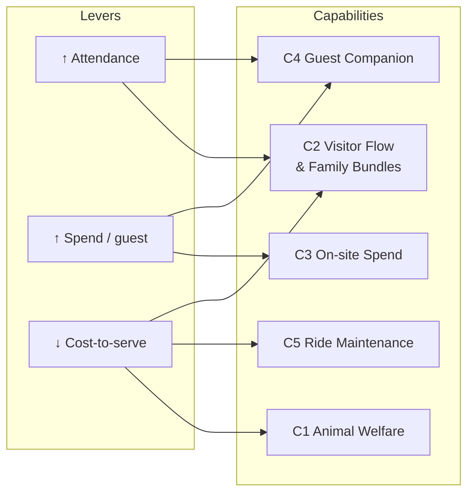

# Von Digitalis Estates — AI-Assisted Architecture

## The thesis

The 72nd Countess Von Digitalis doesn't have an IoT problem or an AI problem. She has a P&L
problem: grow from 5,000 to 15,000 visitors/day within three years, or the family sells the
carnivorous-plant collection. So instead of starting from a components list — event bus, edge
gateway, lakehouse — we started from three financial levers (attendance, spend per guest,
cost-to-serve) and derived the architecture from what each lever actually needs.

Every AI capability in this repo carries a cost, an expected effect, and a **kill criterion**
(see [ADR-005](adrs/ADR-005-ai-funding-gate.md)). If it doesn't pay back, we say so and don't
build it — see "Not building" in [01-business-case.md](01-business-case.md).

The second half of the thesis is about size: this estate is run by a small team, not a platform
organization. So the architecture is a **modular monolith with selective extraction**
([ADR-001](adrs/ADR-001-modular-monolith.md)), not a constellation of independently-deployed
services. Fewer moving parts a five-person team has to keep alive beats an architecture that
looks impressive on a diagram and pages someone at 3am.

## Business-lever map

C2 and C4 each serve two levers — forecasting removes the capacity ceiling on attendance *and*
lets rosters shrink on quiet days; the companion both smooths the visit (return-visit driver)
and upsells in context (spend driver).

## How to navigate this repo

| Section | What's there |
|---|---|
| [01-business-case.md](01-business-case.md) | P&L model, the three levers, baseline, assumptions |
| [02-architecture.md](02-architecture.md) | Style, driving characteristics, container view |
| [03-edge-and-connectivity.md](03-edge-and-connectivity.md) | MQTT store-and-forward, degraded ladder |
| [04-ai-capabilities/](04-ai-capabilities/README.md) | Each AI capability: cost → effect → kill criterion |
| [05-ai-platform.md](05-ai-platform.md) | Model gateway, provider indirection, budgets |
| [06-verification.md](06-verification.md) | Fitness functions, eval gates, latency budget |
| [07-operations.md](07-operations.md) | Observability, SLOs, on-call, DR |
| [08-cost-and-payback.md](08-cost-and-payback.md) | Hardware BOM, run-rate, payback per capability |
| [09-roadmap.md](09-roadmap.md) | Delivery phases |
| [10-risks.md](10-risks.md) | Risks + owners, including AI-native ones |
| [11-how-we-used-ai.md](11-how-we-used-ai.md) | The AI-assisted process behind this submission itself |
| [adrs/](adrs/README.md) | Architecture Decision Records |
| [diagrams/](diagrams/README.md) | Diagram sources (`.mmd`) and rendered exports (`.svg`) for every diagram above |

## Diagram legend

Used consistently across every diagram in this repo:

- **rectangle** = service / component
- **stadium (rounded)** = external system / SaaS / person
- **cylinder** = data store
- **dashed arrow** = asynchronous / event-driven link
- **solid arrow** = synchronous call
- 🤖 = AI inference happens here
- 👤 = a human makes the decision here

## Judges criteria — where the answer lives

| # | Criterion | Where the answer lives |
|---|---|---|
| 1 | Innovative use of AI | [04-ai-capabilities/C3-onsite-spend.md](04-ai-capabilities/C3-onsite-spend.md) (the lever both competitors missed), [ADR-006](adrs/ADR-006-confidence-bands-cost-of-error.md) (cost-priced confidence bands) |
| 2 | Suitability given the constraints | [ADR-001](adrs/ADR-001-modular-monolith.md) (small-team sizing), [01-business-case.md](01-business-case.md) (P&L-first framing) |
| 3 | Appropriate levels of detail | [06-verification.md](06-verification.md) and [08-cost-and-payback.md](08-cost-and-payback.md) — concrete numbers, not vague claims; [02-architecture.md](02-architecture.md)'s ATAM-style worksheet for how the style choice itself was scored, not asserted |
| 4 | Dealing with uncertainty in AI tech | [05-ai-platform.md](05-ai-platform.md), [ADR-004](adrs/ADR-004-ai-gateway-provider-indirection.md), [ADR-005](adrs/ADR-005-ai-funding-gate.md) |
| 5 | AI architectural characteristics match the existing architecture | [02-architecture.md](02-architecture.md) "Why not microservices," [ADR-003](adrs/ADR-003-deterministic-core.md) |
| 6 | Validation & verification of AI results | [06-verification.md](06-verification.md), [ADR-010](adrs/ADR-010-every-inference-is-an-event.md) |

## AI disclosure

This submission was produced with AI assistance throughout — research (analyzing two competing
submissions for gaps and overlaps), scaffolding (file structure, ADR templates), and drafting
(numbers, diagrams, prose below). All figures were reviewed and adjusted by the team before
submission; see [11-how-we-used-ai.md](11-how-we-used-ai.md) for specifics, including where the
assistant's first draft was wrong and had to be corrected.
